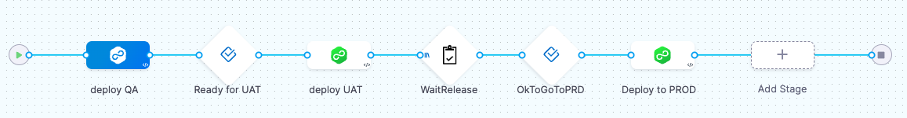

# Description

The [Harness.io](https://www.harness.io/products/continuous-delivery "World's Most Advanced CD Platform") templates you'll find here have been created to be used in a context of release management to manage service deployment dependencies when those services that are part of a same release are deployed by independant pipelines.  

This has been done to answer to the following constraints when a release is deployed accross different environments:
- All dependencies of a service must be deployed before it can be deployed in an environment,
- All services of a release have to be ready to be deployed in production before the release can be deployed in production,
- if the release of an application, A, is dependant of another application, B (with specidfic release), then for A can be ready for deployment in production, B has to be already in production
- When an application release is ready to be deployed in production, a Jira ticket has to be opened and its approval will automatically launch the deployment in production

To [illustrate the usage](#usage-illustration), you've also 2 pipeline definitions that deploy 2 services, one being dependent of the other, representing an application APP2 that is contained in a project with the same name.

Execution of steps, stages based on those templates need to use delegate that have python installed on them. Python version that has been tested with those templates is 3.11.

# Templates

## CreateVariable.yaml

This template is a ShellScript step template that creates an harness string variable at project level and requires the following inputs:  

**API**: API token to access to the project - mandatory  
**VARNAME**: Variable name/id to be created - mandatory  
**VARVALUE**: String value to allocate to the variable - mandatory  
**VARDESC**: description to associate to the variable  

## DeleteVariable.yaml

This template is a ShellScript step template that removes a variable at the project level and requires the followin inputs:  

**API**: API token to access to the project - mandatory  
**VARNAME**: Variable name/id to be removed - mandatory  

## MarkAsDeployed.yaml

This template is a step group template that adds the service identifier of the deployement stage in which it is used to the list of services deployed for a specific release to the environment of the deployment stage. It requires the following inputs:  

**ReleaseName**: The release name for which the service deployed is part of - mandatory  
**ApiKey**: API token to access to the project - mandatory  

## UncheckService.yaml

This template is a step group template that removes the service identifier of the deployement stage in which it is used to the list of services deployed for a specific release to the environment of the deployment stage. It requires the following inputs:  

**RELEASE**: The release name for which the service removed was part of - mandatory  
**API**: API token to access to the project - mandatory  

## WaitDependencies.yaml

This template is a CustomApproval step template that wait until the dependencies requiered by the service, that is deployed in the deployement stage in which it is used, to be declared as deployed. It requires the following inputs:  

**RELEASE**: The release name for which the service to be deployed is part of - mandatory  
**API**: API token to access to the project - mandatory  
**Timeout**: time to wait before stopping the step in timeout error  
**Retry interval**: Interval between each execution occurence  

## WaitReleaseReady.yaml

This template is a CustomApproval step template that wait until all the service of a release to have been deployed in a specific environment for it can be deployed in the next environment. In case the release have dependencies with release of other applications, it also wait until those dependencies to be deployed on the next environment. It requieres the following inputs:

**RELEASE**: The release name for which the service to be deployed is part of - mandatory  
**API**: API token to access to the project - mandatory  
**FROMENVID**: Environment Id on which the services of the release have to be in deployed status to move to next - mandatory  
**TOENVID**: Environment id targetted as the next environment for deployement in which potential dependencies with other applications have to be already deployed - mandatory  
**Timeout**: time to wait before stopping the step in timeout error  
**Retry interval**: Interval between each execution occurence  

## ReleaseReady.yaml

This template is a stage approval template that contain the WaitReleaseReady.yaml step and on top of it add the creation of a Jira ticket indicated that the release is ready to be deployed on the next environment allowing to wait for Jira approval of this ticket to move ahead. It requires the following inputs:

**ReleaseName**: The release name for which the service to be deployed is part of - mandatory  
**api_key**: API token to access to the project - mandatory  
**CreateTicket**: YES or NO values to know if a Jira ticket has to be created - mandatory  
**FromEnv**: Environment Id on which the services of the release have to be in deployed status to move to next - mandatory  
**ToEnv**: Environment id targetted as the next environment for deployement in which potential dependencies with other applications have to be already deployed - mandatory  
**Timeout**: time to wait before stopping the step in timeout error  
**Retry interval**: Interval between each execution occurence  

## ResetTicket.yaml

This template is a custom stage template to remove from the buffer the jira ticket that has been created for a release during ReleaseReady stage. It requieres the following inputs:  

**RELEASE**: The release name for which the buffer has to be cleaned - mandatory  
**API**: API token to access to the project - mandatory  

# Usage illustration

To illustrate the usage, let's take a simple application that we'll name APP2 and that is composed of 2 services for its first Release that we'll name V1:  
1. recommendation  
2. productcatalog  

Service recommendation is dependant of service productcatalog which means that productcatalog has to be deployed before recommendation can be deployed. Then to specify our application for release V1, we need to have 3 config files in the File store of APP2:  
- V1_recommendation.json that contains the dependency definition for service recommendation (can also be located in a git repo)
- V1_productcatalog.json that contains the dependency definition for service productcatalog (can also be located in a git repo)
- V1_ReleaseAvailability.json that contains the definition of all needed services for the release to be available

In each services is created a Config File with id *dependencies* with the name variabalized with the release name. Then the service definition doesn't need to be change for each release. To do so, in our exemple, each pipeline that will be used to deployed our APP2 services will have a variable named *RemeaseName*. In our exemple the 2 APP2 services have a config files that is defined as follow:  

**recommendation**:  
  Config file identifier: dependencies  
  File/Folde Path: /<+pipeline.variables.ReleaseName>_recommendation.json  

**productcatalog**:  
  Config file identifier: dependencies  
  File/Folde Path: /<+pipeline.variables.ReleaseName>_productcatalog.json  

  In my exemple, the 2 services will be deployed on a kubernetes clusters and for clarity I created a pipeline for each service when it is possible to have only one pipeline with the service to deploy as input. Both pipeline are the same exepted regarding the service they're deploying. They're composed of the following stages:  

  - **deploy QA**: deploy the service to QA environment  
  - **Ready for UAT**: Harness manual approval before going to UAT environment (with 1 minute timeout for auto approval)  
  - **deploy UAT**: deploy the service to UAT environment  
  - **WaitRelease**: Wait for all the services of the APP2 release to have been deployed in UAT, and potential dependencies to other application to be on PROD before it can be possible to move to PROD and open a Jira ticket requesting to move to PROD.
  - **OkToGoToPRD**: waiting for the Jira ticket approval  
  - **Deploy to PROD**: deploy the service to PROD environment  
  - **CleanCache**: clean the cache used to manage the Jira ticket accross various pipeline.

    

