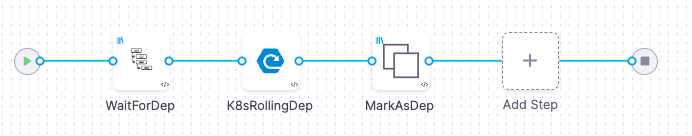

# Description

Those script has been written to be used in a context of release management to manage service deployment dependencies when those services that are part of a same release are deployed by independant pipelines using [CD from Harness.io](https://www.harness.io/products/continuous-delivery "The best CI/CD platform"). 

This has been done to answer to the following constraints when a release is deployed accross different environments:
- All dependencies of a service must be deployed before it can be deployed in an environment,
- All services of a release have to be ready to be deployed in production before the release can be deployed in production,
- if the release of an application, A, is dependant of another application, B (with specidfic release), then for A can be ready for deployment in production, B has to be already in production
- When an application release is ready to be deployed in production, a Jira ticket has to be opened and its approval will automatically launch the deployment in production

This can be illustrated with the following pipeline:  
  

With deployment stage beeing like:  


What ever is the deployment process of the service (in the exemple it is a K8s deployment), the first step of the deployment stage is to wait for the dependencies and the last step is to declare that the service has been deployed.

In the sub directory HarnessSample you'll find harness template using the scripts and an full exemple with all needed object for an application release management following the constraints as mentioned before.

# Role and usage of each script

## CreateVariable.py

This script create an harness string variable at project level.  

Command to launch the script from a shell ( with the right value in the variables):
```
python3 CreateVariable.py --account "$ACCOUNT" --api_key "$API" --OrgId "$ORG" --ProjId "$PROJ" --Name "$VARNAME" --Value "$VARVALUE" --desc "$VARDESC"
```
**account**: Harness account id  
**api_key**: Harness api key allowing to access to the targeted project with the needed rights  
**OrgId**: Organisation identifier  
**ProjId**: Project identifier  
**Name**: The variable Name/identifier that should not already exist  
**Value**: The string value to allocate to the variable  
**desc**: descrition of the variable  

## DeleteVariable.py

This script delete an harness variable.  

Command to launch the script from a shell ( with the right value in the variables):
```
python3 DeleteVariable.py --account "$ACCOUNT" --api_key "$API" --OrgId "$ORG" --ProjId "$PROJ" --Name "$VARNAME"
```
**account**: Harness account id  
**api_key**: Harness api key allowing to access to the variable with the needed rights  
**OrgId**: Organisation identifier if the variable to delete is at organisation level or project level  
**ProjId**: Project identifier if the variable to delete is at project level  
**Name**: The variable identifier to delete  

## AddServiceToReleaseEnv.py

This script create or update a variable that with an identifier that is the ReleaseName_Status for which we want to update the deployed components (services) for a specific environment. The goal is to be able to follow the deployment status of a release. For exemple if 2 services, serv1 and serv2, has been deployed to QA, UAT and PROD environments for release V1 of application (poject) APP1, then variable V1_Status should have been created and updated in project APP1 containing:  
```
[
    {"env_id": "QA", 
     "services": [serv1, serv2]}, 
    {"env_id": "UAT", 
     "services": [serv1, serv2]}, 
    {"env_id": "PROD", 
     "services": [serv1, serv2]}
]
```

Command to launch the script from a shell ( with the right value in the variables):
```
python3 AddServiceToReleaseEnv.py --account "$ACCOUNT" --api_key "$API" --OrgId "$ORG" --ProjId "$PROJ" --Service "$SERVICE" --EnvId "$ENVID" --ReleaseName "$RELEASE"
```
**account**: Harness account id  
**api_key**: Harness api key allowing to access to the targeted project with the needed rights  
**OrgId**: Organisation identifier  
**ProjId**: Project identifier  
**Service**: The service identifier that was deployed  
**EnvId**: The environment identifier in which the service was deployed
**RleaseName**: The release name associated with the deployment